## Що сталося?

[На початку жовтня 2026 року](https://t.me/oleksiihoncharenko/57307) народний депутат Олексій Гончаренко опублікував [у Telegram](https://t.me/oleksiihoncharenko/57308) серію дописів, у яких запропонував «[домовлятись про все на світі](https://t.me/oleksiihoncharenko/57309)» з росією. За його версією, Україні варто самій виступити «за зняття санкцій з Росії» в обмін на припинення далекобійних ударів, розблокування Чорного моря та «обмеження бойових дій ділянкою фронту на Донбасі».

Протягом кількох днів весь інтернет-простір [обговорював контроверсійні тези](https://www.radiosvoboda.org/a/news-goncharenko-prograjemo-vijnu-reakcija-es/33869366.html). Партія «Європейська Солідарність» одразу [вийшла із протилежною заявою](https://eurosolidarity.org/2026/10/02/zayava-frakcziyi-yevropejska-solidarnist-9/). [Відреагував навіть Президент](https://inshe.tv/politics/2026-10-04/1021281/). В понеділок, 5 жовтня, скандального нардепа [виключили з фракції](https://t.me/officialeurosolidarity/21096) «ЄC» у Парламенті.

Пропозиції Гончаренка активно підхопили та масштабували [ресурси держави-агресора](https://activeorgua-bit.github.io/honcharenko/dashboard/) та [канали з проросійських сіток](https://claude.ai/artifact/EDxCedBwQtYxUXCUGLRBQp). Ми проаналізували видачу сервісу Телеметріо (українські та російські канали за запитами, що стосуються нардепа) і виявили, що російські канали погоджуються із заявами Гончаренка про мир та критикою ТЦК в рази частіше за українські (що й не дивно): тезу про ТЦК — 23% проти 7%, про мир — 6,1% проти 2,2%.

Серед українських Telegram-каналів, які найчастіше погоджуються з тезами Гончаренка, фігурують «MediaKiller» та «Женщина с косой». За даними «Детектора медіа» обидва входять до переліку проросійських каналів. Тобто «українську» підтримку депутату нерідко висловлюють канали, які «Детектор медіа» відносить до проросійських.

Згідно зі знімком російської видачі Google від 3 жовтня 2026 року за запитом «Алексей Гончаренко», із 45 результатів, датованих 2025–2026 роками, 25 були опубліковані саме в період 1–3 жовтня 2026 року, і 16 із цих 25 цитують його саме про мир.

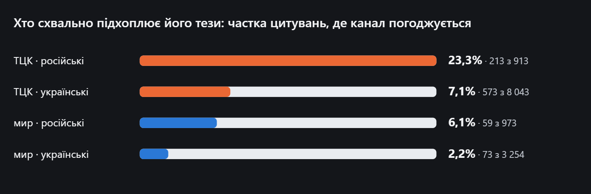

Хто схвально підхоплює його тези: частка цитувань, де канал погоджується

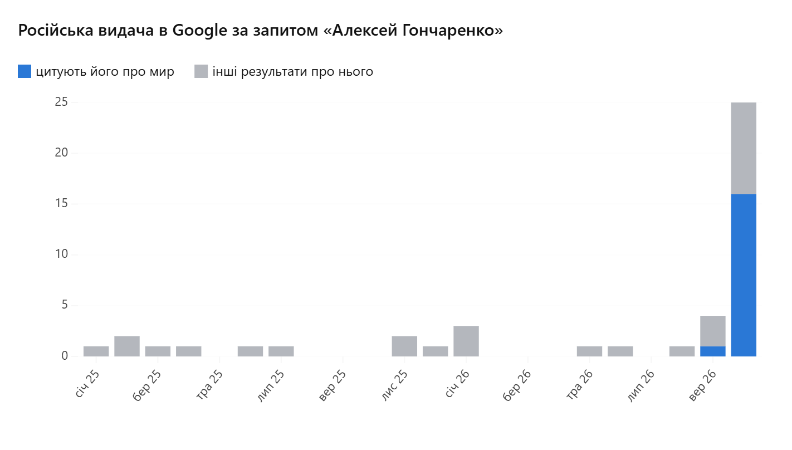

Російська видача в Google за запитом «Алексей Гончаренко»

## Хто такий Гончаренко

Олексій Гончаренко [народився в Одесі](https://znaj.ua/dossier/583-oleksiy-goncharenko-biografiya-i-dosye-kompromat). Батько політика — Олексій Костусєв, колишній мер Одеси (2010–2013) та народний депутат [трьох скликань](https://uk.wikipedia.org/wiki/Костусєв_Олексій_Олексійович); на момент народження Олексія працював [інженером](https://dumskaya.net/candidate/azarov/bio/) в Одеському інституті морського флоту. Cам Гончаренко [публічно називає його](https://gordonua.com/ukr/publications/goncharenko-buli-vipadki-koli-na-moh-rukah-pomirali-lyudi-1504738.html) своїм [рідним батьком](https://t.me/oleksiihoncharenko/38054). Мати — Марина Федорівна Гончаренко: працювала в одеському порту, згодом у музеї Морфлоту, а потім викладала в одеській школі та Приморському ліцеї. Батьки розлучилися, коли синові було три роки.

Гончаренко закінчив Одеську гімназію №2, здобував вищу освіту в [Одеському державному медичному університеті](https://www.slovoidilo.ua/persony/honcharenko-oleksii-oleksiiovych) (педіатрія) а також... в росії: у 2002-2005 роках навчався в Академії народного господарства при уряді рф. Також Гончаренко був у Москві [у 2015 році](https://regionews.ua/ukr/dossier/goncharenko-aleksey-alekseevich-19062025), де брав участь у марші пам’яті вбитого опозиціонера Бориса Нємцова, за що був [затриманий](https://regionews.ua/ukr/dossier/goncharenko-aleksey-alekseevich-19062025).

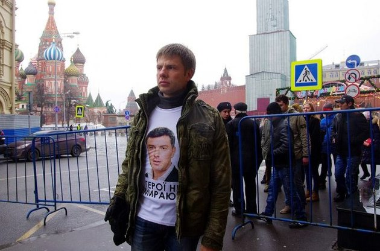

Гончаренко у Москві, на марші пам’яті Нємцова (2015)

[Одружився](https://glavcom.ua/scotch/live/ti-moja-najsilnisha-storona-nardep-honcharenko-nizhno-privitav-druzhinu-z-richnitseju-1006344.html) майбутній політик [2003 року](https://gordonua.com/ukr/bulvar/news/-nardep-goncharenko-podilivsja-u-sotsialnih-merezhah-vesilnimi-znimkami-1505566.html); на весілля, [за його словами](https://uc.kr.ua/2021/12/21/oleksij-goncharenko-tse-nejmovirne-shhastya-buty-lyublyachym-cholovikom-i-spravzhnim-batkom-dlya-dvoh-syniv/), він запросив батька, якого перед тим розшукав. З [дружиною Ольгою](https://uk.wikipedia.org/wiki/Гончаренко_Олексій_Олексійович) (у дівоцтві Глова) познайомився під час навчання в медуніверситеті; за фахом вона дитячий лікар. Зараз Ольга Гончаренко — підприємиця, її ФОП зареєстрований за КВЕД «[комп'ютерне програмування](https://youcontrol.com.ua/catalog/fop_details/25781623/)», і саме її бізнес — головне джерело [доходів](https://public.nazk.gov.ua/documents/6912a0cc-0c51-4190-97bc-945d3e4db1c6) родини: 58 із 69 млн грн сукупного задекларованого доходу родини за десять років[^23].

У дружини Гончаренка також є російський слід. Його тесть, [за словами самого нардепа](https://www.youtube.com/watch?v=nUhnlRXnD6A), у 80-х і на початку 90-х працював у «Газпромі» — тоді, як уточнив Гончаренко, це називалося Міністерством газової промисловості СРСР — водієм і оператором бурової на вахті, а під час корпоратизації «Газпрому» отримав акції компанії. Роботою тестя в «Газпромі» Гончаренко пояснював і [700 тисяч доларів](https://politerno.com.ua/2017/02/23/goncharenko-zayavyv-shho-700-tysyach-dolariv-jomu-pozychyv-test/), які, за словами самого нардепа, позичив у останньому. Варто зазначити, що перша заява пролунала у 2017 році, у [2020-му](https://gordonua.com/ukr/publications/goncharenko-buli-vipadki-koli-na-moh-rukah-pomirali-lyudi-1504738.html) Гончаренко це заперечив, але у 2026-му, в [інтерв’ю Данилу Мокрику](https://www.youtube.com/watch?v=nUhnlRXnD6A), знову зазначив, що позичав і повернув.

## Політична кар'єра та переконання

Свій шлях у політиці Олексій розпочав [у 2001 році](https://uk.wikipedia.org/wiki/Гончаренко_Олексій_Олексійович) в лавах Партії зелених України. Згодом долучився до Партії «Союз», яку [з жовтня 2004 року](https://uk.wikipedia.org/wiki/Костусєв_Олексій_Олексійович) очолював Костусєв. Наприкінці 2005 року одеські організації «Союзу» влилися до Партії регіонів.

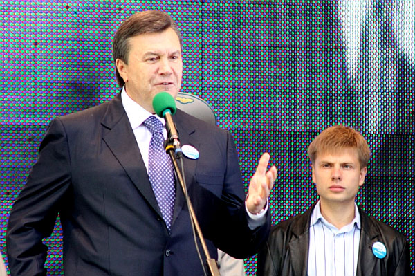

Фото із сайту Гончаренка. Опубліковане УП у 2011 (https://www.pravda.com.ua/rus/articles/2011/06/01/6260362/)

У 2006 році батько й син пішли на вибори вже як «регіонали»: Костусєв став народним депутатом за списком Партії регіонів, а Олексій був обраний до Одеської міської ради від цієї партії. Одразу після обрання Гончаренко увійшов [до комісії](https://omr.gov.ua/ua/acts/mayor/3984/), яка перевіряла умови функціонування російської мови в Одесі.

1 червня 2011 року в [інтерв’ю «Українській правді»](https://www.pravda.com.ua/articles/2011/06/01/6260362/) він заявляв: «*моя точка зрения, что русский язык должен быть вторым государственным*». Влітку 2012 року, за даними ЗМІ, його білборди з рядком «[Мы уважать себя заставим!](https://uainfo.org/blognews/17859-na-bilbordah-v-odesse-regional-goncharenko-ispolzoval-umirayuschego-dyadyu-onegina.html)» були частиною кампанії на підтримку мовного законопроєкту Ківалова–Колесніченка. А в серпні того ж року Одеська облрада визнала російську регіональною мовою області. Гончаренко тоді був заступником голови цієї ради.

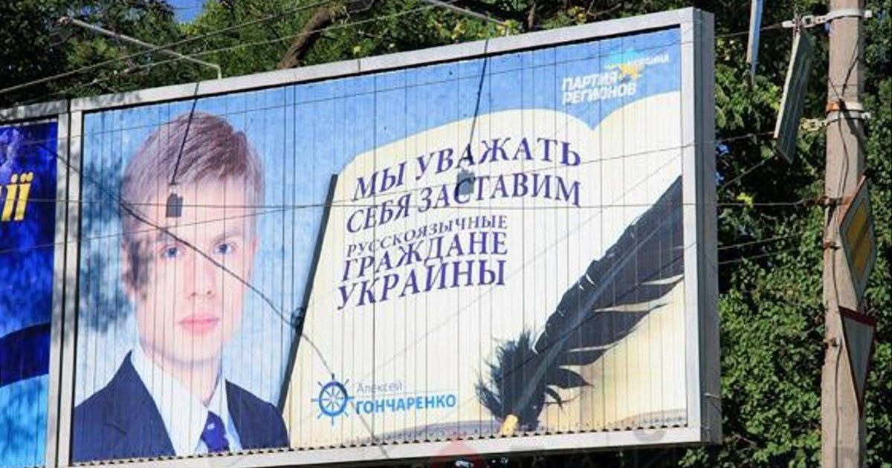

Білборди Гончаренка, Одеса, 2012 рік

Риторика й партійна приналежність політика різко змінилися під час Революції Гідності. [19 лютого 2014 року](https://bihus.info/nardep-goncharenko-v-separatistskikh-nastroyakh-na-skhodi-e-i-moya-vina/) Гончаренко, тоді заступник голови Одеської облради, заявив про вихід із Партії регіонів. Вже восени 2014 року він обрався [народним депутатом 8 скликання](https://suspilne.media/amp/odesa/1009481-ne-vvazau-rosijsku-movu-vlasnistu-putina-narodnij-deputat-oleksij-goncarenko/) за списком партії «Блок Петра Порошенка». [З 11 лютого 2015 року](https://news.pn/ru/politics/125824) став заступником голови фракції БПП у парламенті.

Втім, ще у 2016 році Гончаренко захищав двомовність — він казав, що йому не соромно за ту кампанію, бо «*те, що наша держава є двомовною,* [це наша сильна сторона](https://www.5.ua/interview/oleksii-honcharenko-110501.html)». Уже після повномасштабного вторгнення, 4 травня 2025 року, він заявив «[Суспільному](https://suspilne.media/amp/odesa/1009481-ne-vvazau-rosijsku-movu-vlasnistu-putina-narodnij-deputat-oleksij-goncarenko/)»: «*ні про яку державну мову мови немає більше*».

У 2019 році Гончаренка було знову обрано до Верховної Ради — [по 137 виборчому окрузі](https://itd.rada.gov.ua/mps/info/page/17984) в Одеській області, як безпартійного самовисуванця. [29 серпня 2019 року](https://w1.c1.rada.gov.ua/pls/site2/p_deputat_fr_changes?d_id=17984), у день набуття депутатських повноважень 9 скликання, він вступив до фракції «Європейська Солідарність».

## З батьком «не спілкується»

Публічно [Олексій Гончаренко стверджує](https://t.me/oleksiihoncharenko/38053), що розірвав стосунки з батьком ще [у 2009 році](https://gordonua.com/ukr/publications/goncharenko-buli-vipadki-koli-na-moh-rukah-pomirali-lyudi-1504738.html). Проте у Верховній Раді VI скликання, де Костусєв був депутатом [у 2007–2010 роках](https://esu.com.ua/article-6117), до обрання міським головою Одеси, Гончаренко офіційно значився[^38] його [помічником на громадських засадах](https://nashigroshi.org/2015/12/03/pomichnyky-nardepiv-2007-2012-k-k/). Попри заяви про розрив, [5 листопада 2010 року](https://lb.ua/news/2010/11/06/72993_tv_debati_posle_viborov.html), батько і син перетнулися в ефірі «Шустер Live», де Гончаренко публічно виступив на захист Костусєва.

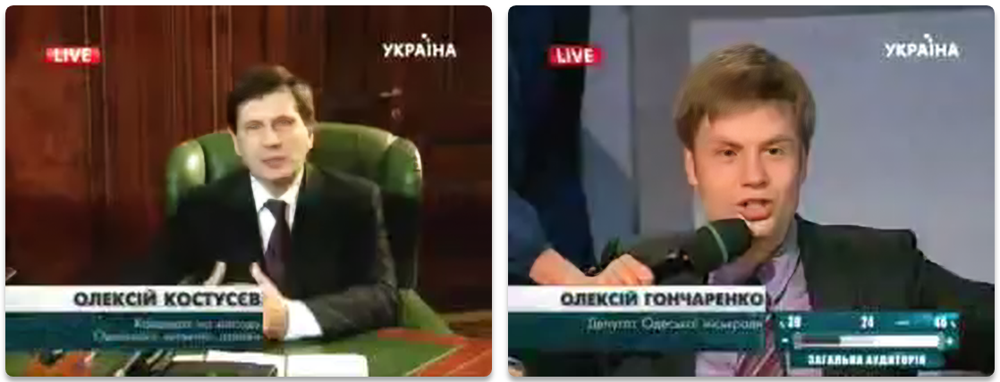

Запис ефіру від 05.11.2010 зберігся на російському відеохостингу (https://rutube.ru/video/d61930c123b283ba25a92112277daf37/?t=1972)

Зв’язок між політиками простежується і через спільні кадри. Олексій Потапський [у Верховній Раді VI скликання](https://t.me/s/chesno_movement/9336) працював помічником-консультантом на громадських засадах Олексія Костусєва. Згодом він став [помічником Олексія Гончаренка](https://itd.rada.gov.ua/mps/info/page/17984). Нині Потапський є [директором проєкту «Гончаренко центр»](https://goncharenkocentre.com.ua/). Його дружина, [за декларацією Потапського](https://public.nazk.gov.ua/documents/238d2ac3-119d-46df-bd80-abb8153dec19) за 2024 рік, — Ганна Анатоліївна Чередниченко, [приватна нотаріуска в Одесі](https://youcontrol.com.ua/catalog/notaries/odesa/0802-odesa/3811-cherednychenko-hanna-anatoliyivna/). Одеське [видання «Од-ньюс»](https://od-news.com/2011/05/13/19105/) у 2011 році писало, що перша дружина Костусєва — Галина Чередниченко, а їхня донька Анна має по батькові «Анатольевна», бо її вдочерив дід. Ім'я та по батькові збігаються з даними дружини Потапського, а прізвище — з прізвищем першої дружини Костусєва, тож вона може бути донькою Костусєва від першого шлюбу (хоча підтвердження цього в офіційних реєстрах чи документах ми не знайшли).

[У серпні 2023 року](https://www.ukrinform.ua/rubric-regions/3830806-vaks-dozvoliv-zaocne-rozsliduvanna-sodo-eksmera-odesi-kostuseva.html) детективи НАБУ повідомили Олексію Костусєву про підозру у справі щодо заволодіння майном одеського аеропорту і згодом оголосили його в розшук. Тоді Гончаренко [повторив](https://t.me/oleksiihoncharenko/38054) у своєму телеграм-каналі, що давно не спілкується з батьком. [За даними журналістів](https://parlament.ua/news/kolishnij-mer-odesi-kostusev-perehovuetsya-vid-pravosuddya-u-rozkishnomu-maetku-v-velikij-britanii/), станом [на квітень 2024 року](https://dumskaya.net/news/eks-mer-odessy-aleksey-kostusev-pryachetsya-ot-s-183481/ua/) [ексмер Одеси](https://informer.od.ua/news/eksmer-odesy-yakogo-rozshukuye-nabu-prozhyvaye-poblyzu-londona/) разом із сім'єю винаймав будинок у престижному лондонському районі Річмонд. [У червні 2025 року](https://suspilne.media/odesa/1042047-maut-vidskoduvati-ponad-1-milard-griven-vaks-zasudiv-figurantiv-spravi-aeroportu-odesa/) Вищий антикорупційний суд затвердив угоду про визнання винуватості [семи обвинувачених](https://gordonua.com/ukr/news/society/v-ukrajini-zatverdili-najbilshu-uhodu-pro-viznannja-vinuvatosti-fihuranti-vidshkodujut-ponad-1-mlrd-hrn--1745636.html) у справі аеропорту «Одеса», серед яких і Костусєв; засуджені отримали умовне покарання з іспитовим строком.

## Сімейні бізнеси

За даними Єдиного державного реєстру (ЄДР), Олексій Гончаренко офіційно є керівником, засновником або бенефіціаром низки структур:

• ГО «Якість життя» ([ЄДРПОУ 26343186](https://clarity-project.info/edr/26343186)) — бенефіціар, керівник та підписант.

• ВГО «За якість життя в Україні!» ([ЄДРПОУ 37759948](https://clarity-project.info/edr/37759948)) — бенефіціар та керівник.

• ГО «ВИ.МОВА» ([ЄДРПОУ 43417706](https://clarity-project.info/edr/43417706)) — засновник. За інформацією на [сайті мережі](https://goncharenkocentre.com.ua/yak-vidkryty-goncharenko-centre-u-vashomu-misti/), «Гончаренко центрами» оперує саме ця організація: з нею партнери підписують договір про співпрацю.

• Одеська територіальна організація політичної партії «Європейська Солідарність» ([ЄДРПОУ 39607381](https://clarity-project.info/edr/39607381)) — керівник.

Він також був керівником двох припинених організацій: Одеська міська організація партії «Союз» ([ЄДРПОУ 25932756](https://clarity-project.info/edr/25932756)) та ТОВ «Компанія „Вимпел-Груп Південь“» ([ЄДРПОУ 37542147](https://clarity-project.info/edr/37542147)).

Більшість пов'язаних із нардепом організацій об'єднує одна адреса в історичному центрі Одеси: вулиця Канатна, 10. Тут зареєстровано одеський [осередок «Європейської Солідарності»](https://activeorgua-bit.github.io/cc-callcenters/), а поруч із ним — компанії родини й помічників та пов'язане з ними медіа: ТОВ «Таксі Бонд», ТОВ «Старк Індастріз», ГО «Асоціація журналістів „Думська“», ТОВ «Привид», ТОВ «Торговий дім „Лана-Агротранс“» та кооператив «Автопромсервіс».

**ТОВ «Старк Індастріз»** ([ЄДРПОУ 37810045](https://znaj.ua/dossier/583-oleksiy-goncharenko-biografiya-i-dosye-kompromat)) — компанія матері депутата. Її єдина засновниця й кінцева бенефіціарка — Марина Гончаренко, статутний капітал — [315 тис. грн](https://clarity-project.info/edr/37810045); керівник — Петро Обухов, який значиться [помічником-консультантом Гончаренка](https://itd.rada.gov.ua/mps/info/page/17984) на громадських засадах. Компанія здає в оренду нерухомість: [у січні–березні 2020 року](https://nazk.gov.ua/wp-content/uploads/2020/04/PDF-11.pdf) вона безоплатно надавала партії «За Одещину» частину приміщення на Канатній, 10, а за чотири роки пожертвувала [понад 67 тис. грн](https://www.chesno.org/post/6335/) одеській організації «*Європейської Солідарності*». В ухвалі слідчого судді [від 24.06.2025](https://reyestr.court.gov.ua/Review/129703552) у справі ДБР про легалізацію коштів та ухилення від сплати податків, серед фігурантів якої агрофірми «Бургуджі» й «Ташлик», «Старк Індастріз» разом із «Таксі Бонд» названо серед афілійованих компаній, які, за версією слідства, «можуть бути задіяні» у схемі.

**ТОВ «Привид»** ([ЄДРПОУ 37810019](https://clarity-project.info/edr/37810019)) — IT-консалтинг, єдиний засновник і керівник — Дмитро Фісінчук. Її зареєстрували того ж дня, що й «Старк Індастріз», — 11 липня 2011 року, і номери записів обох компаній в ЄДР ідуть підряд.

**ГО «Асоціація журналістів „Думська“»** ([ЄДРПОУ 45578516](https://clarity-project.info/edr/45578516)) зареєстрована на тій самій адресі; засновником однойменного інтернет-видання [журналісти називають](https://vybory.rbc.ua/ukr/2020/izvestno-kandidate-mery-odessy-petre-obuhove-1602250440.html) Петра Обухова. Перебуває у стані припинення.

**ТОВ «Торговий дім „Лана-Агротранс“»** ([ЄДРПОУ 38858355](https://clarity-project.info/edr/38858355)) і **кооператив «Автопромсервіс»** ([ЄДРПОУ 13873936](https://clarity-project.info/edr/13873936)) також значаться на Канатній, 10.

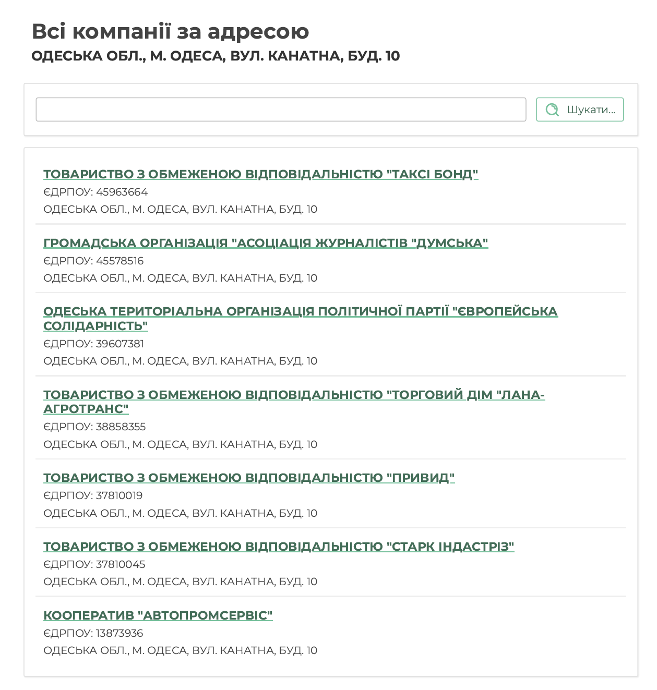

image

**«Таксі Бонд» — імовірно, сімейний бізнес Гончаренків.** Формально таксі належало помічнику депутата Петру Обухову: за документами, з 2016 року[^68] він очолював ТОВ «[Таксі Бонд](https://public.nazk.gov.ua/documents/fbb19adc-5197-4237-bcfc-471df1f7c4d3)», у власній декларації за 2024 рік указав себе її кінцевим бенефіціаром, а у 2022 році зареєстрував на себе відповідні [торгові марки](https://public.nazk.gov.ua/documents/153d91c8-3e08-4974-9098-07ec3204e8c8). Проте сам Гончаренко неодноразово говорив про це таксі як про родинне. У 2020 році він розповів [в інтерв'ю ISLND TV](https://styler.rbc.ua/ukr/persona/kozak-gavrilyuk-taksist-vsplyl-novyy-interesnyy-1584729149.html), що влаштував ексколегу-нардепа Михайла Гаврилюка водієм у службу таксі «Бонд». А [в розмові з Данилом Мокриком](https://www.youtube.com/watch?v=nUhnlRXnD6A) на запитання, чи «Бонд Таксі» — історія його дружини, відповів: «*Ну, не тільки, але в тому числі, да. Моя родина — співвласники*».

У 2025 році компанію було переоформлено: змінилися назва, власник і керівник. Компанія з кодом 40644259, яку Обухов декларував як «Таксі Бонд», тепер називається «Смартдевелопмент»: [з 16 травня 2025 року](https://clarity-project.info/edr/40644259) її єдиний власник і керівник — Ілля Мозолєв, а основна діяльність — оренда нерухомості. Кандидат із таким самим ПІБ — імовірно, та сама особа — у 2010 році, за відомостями ЦВК, був членом Партії регіонів. Натомість 30 червня 2025 року зареєстрували нове ТОВ «Таксі Бонд» (ЄДРПОУ 45963664) зі статутним капіталом [7 007 007 грн](https://clarity-project.info/edr/45963664) і послугами таксі серед видів діяльності — його єдиний засновник, бенефіціар і керівник Михайло Шмушкович, депутат Одеської облради від «Європейської Солідарності». Нова компанія зареєстрована на тій самій [Канатній, 10](https://opendatabot.ua/c/45963664).

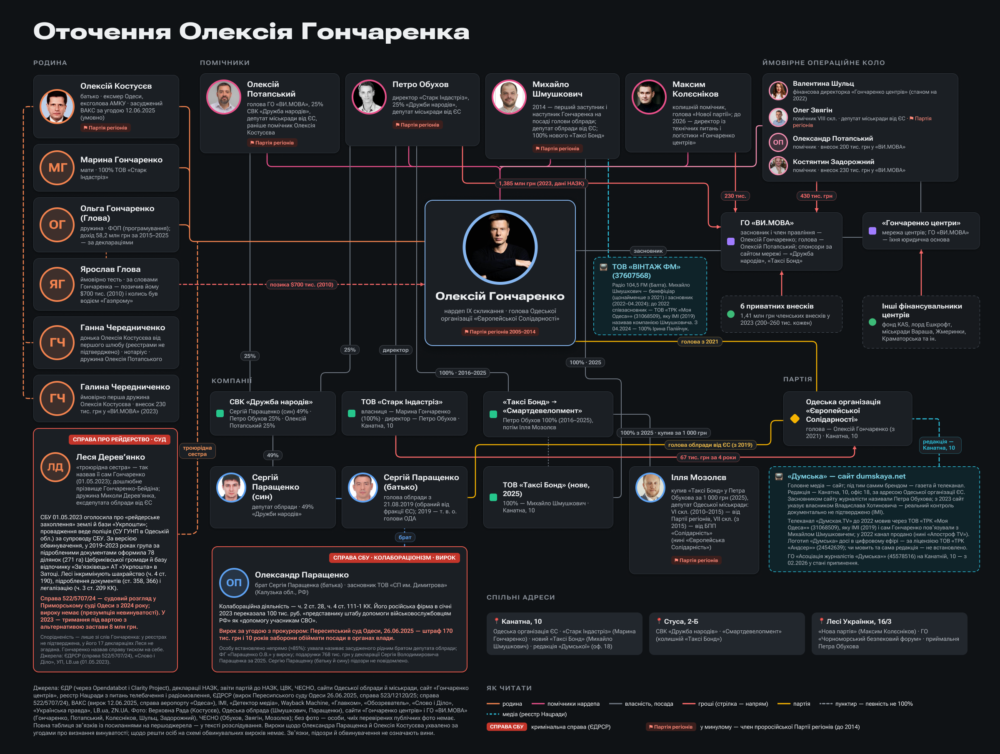

Honcharenko_people

**Серед організацій оточення Гончаренка — щонайменше три медіа.** Два з них раніше належали Михайлу Шмушковичу — помічнику Гончаренка на громадських засадах і депутату Одеської облради від «ЄС». Третє [досі зареєстроване на батька депутата](https://clarity-project.info/edr/35358531), ексмера Одеси Олексія Костусєва.

**«Думська»** — сайт, газета й телеканал під одним брендом. У 2019 році [ІМІ писав](https://imi.org.ua/articles/hto-vplivae-na-odeski-zmi-i162), що «Думская.TV» мовить через ТОВ «*Телерадіокомпанія „Моя Одеса“*» (ЄДРПОУ 31068509), кінцевим власником і засновником якої є Шмушкович, «близький соратник» Гончаренка. Сам [Гончаренко того ж року назвав](https://dumskaya.net/news/nabu-provodit-obyski-na-telekanale-dumskaya-tv-106790/) «ДумскуюТВ» каналом, «*которым владеет мой друг и заместитель в областной ячейке Европейской Солидарности Михаил Шмушкович»*. У лютому 2022 року канал [змінив власника](https://detector.media/rinok/article/217420/2023-09-28-vlasnyk-apostrofa-tv-kupyv-odeskyy-kanal-dumskayatv-natsrada-vnesla-zminy-v-reiestr/). Сьогодні ТРК «Моя Одеса» належить [ТОВ «Апостроф Медіа»](https://opendatabot.ua/c/31068509). Логотип «Думська» при цьому, за даними [Нацради з питань телебачення та радіомовлення](https://webportal.nrada.gov.ua/wp-content/uploads/2026/09/dodatok_perelik-subyektiv-u-sferi-media-stanom-na-01.09.2026.xlsx), досі присутній в ефірі Одеси та області — за ліцензією ТОВ «ТРК „Андсер“» (ЄДРПОУ 24542639). Ця компанія [належить громадянину Німеччини Міхаелю Берзуну](https://clarity-project.info/edr/24542639), і за реєстром до Шмушковича вона стосунку не має.

Сьогодні сайт «Думська» [називає власником](https://dumskaya.net/site/Adres/) іншу, непублічну особу — Владислава Хотиновича, а актуальний контроль [документами не підтверджено](https://imi.org.ua/blogs/hto-stoyit-za-media-odeshchyny-imi-pereviryv-vidkrytist-sajtiv-i-telekanaliv). Ще [у грудні 2022 року](https://web.archive.org/web/20221227162230/https://dumskaya.net/site/Adres/) власника на сайті не було вказано взагалі; рядок «*Власник — Владислав Хотинович*» з'явився до вересня 2023 року — разом з адресою редакції: та сама Канатна, 10, [офіс 18](https://web.archive.org/web/20230927171905/https://dumskaya.net/site/Adres/). Офіційною власницею друкованого видання «Думська» (ідентифікатор R30-01496) в Реєстрі медіа є Лопатюк Ірина Ігорівна. А ГО «Асоціація журналістів „Думська“» з лютого 2026 року перебуває в стані припинення.

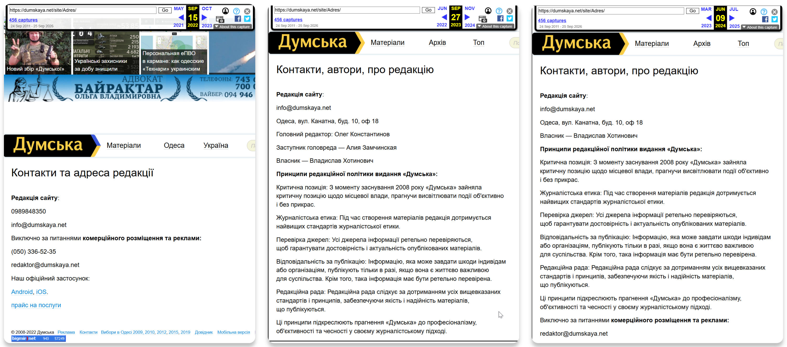

**«Вінтаж ФМ»** (ТОВ «Вінтаж ФМ», ЄДРПОУ 37607568). [У 2019 році](https://clarity-project.info/edr/37607568) будівельну фірму «Вінтажбудмаркет» перейменували на «Вінтаж ФМ» і переорієнтували на радіомовлення. Серед її засновників значилася та сама ТРК «Моя Одеса», а бенефіціаром був Шмушкович. У лютому 2022 року — того ж місяця, коли змінився власник телеканалу, — він став засновником «Вінтаж ФМ» особисто. У квітні 2024 року Шмушкович вийшов зі складу власників: компанія перейшла до Ірини Палійчук, а її адресу перенесли з Одеси до Балти. Там радіо тепер мовить як «[Балта ФМ](https://www.radio-ua.com/balta-fm)».

**«Нова Хвиля»** (ЄДРПОУ 35358531) — з 2008 року належало Костусєву: він досі значиться засновником, хоча з січня 2024 року в графі «кінцевий бенефіціар» його вже немає, а нового бенефіціара не вказано. Компанія тримає ліцензію L11-00355 на частоту 90,2 МГц в Одесі, і в ефірі на ній — «[[Радіо РОКС – Україна](https://webportal.nrada.gov.ua/wp-content/uploads/2026/09/dodatok_perelik-subyektiv-u-sferi-media-stanom-na-01.09.2026.xlsx)](https://webportal.nrada.gov.ua/wp-content/uploads/2026/09/dodatok_perelik-subyektiv-u-sferi-media-stanom-na-01.09.2026.xlsx)» медіагрупи ТАВР Медіа[^89].

Також є ще одна компанія з назвою, що нагадує радіостанцію — ТОВ «Дюк ФМ» (ЄДРПОУ 34381219), [зареєстроване у 2006 році](https://clarity-project.info/edr/34381219). Її єдина власниця — Ольга Матвєєва, а директор — Володимир Огрохін. Той самий Огрохін з 2014 року очолює і «Нову Хвилю» Костусєва. Обидві компанії зареєстровані за однією адресою: Одеса, вул. [Середньофонтанська, 19-А, офіс 320](https://www.ua-region.com.ua/34381219). Утім, попри назву, «Дюк ФМ» не мовить. У Реєстрі суб'єктів у сфері медіа цієї компанії немає, а основний вид її діяльності — рекламні агентства.

## Гончаренко центри

Олексій Гончаренко відомий своїм «фірмовим» форматом роботи з виборцями — замість традиційних громадських приймалень по всій країні працюють так звані «Гончаренко центри». І замість популярних в часи розквіту «регіоналів» продуктових наборів, надають там безплатні освітні послуги. Організація влаштовує курси англійської, уроки танців, гуртки для дітей та інші активності. На [сайті «центрів»](https://goncharenkocentre.com.ua/) вказано, що таких осередків на сьогодні вже 54. Згідно з [фінансовою звітністю ГО «ВИ.МОВА»](https://goncharenkocentre.com.ua/wp-content/uploads/2026/02/Finansova_zvitnist_malogo_pidpriiemstva_2023.pdf), на якій тримається мережа, річні доходи організації з 2023 року перевищують [двадцять мільйонів гривень](https://goncharenkocentre.com.ua/wp-content/uploads/2026/02/Finansova_zvitnist_malogo_pidpriiemstva_2024.pdf) і зростають.

### **Гроші та звітність**

У звіті про фінансові результати за 2023 рік ідеться про 20,8 млн грн доходів, а за 2024 рік ця цифра зростає вже до 27,4 млн грн. Згідно зі звітністю, середня кількість працівників ГО «ВИ.МОВА» у 2023 році становила 38 осіб. Водночас на англомовній сторінці сайту Гончаренка, де йдеться про 31 центр станом на лютий 2024 року, вказано, що в мережі працює близько [120 людей](https://goncharenko.org/goncharenko-centre/).

За даними [розслідувачів руху ЧЕСНО](https://www.chesno.org/post/6335/), головними донорами ГО виступають Сільськогосподарський виробничий кооператив «Дружба народів», ТОВ «Таксі Бонд», агрохолдинг «Укрлендфармінг», британський лорд Ешкрофт; той самий перелік спонсорів наведено й на сайті мережі. Серед «друзів та партнерів» мережа також називає закордонні організації: Пенсильванський університет (University of Pennsylvania), тайванські Shih Chien University та National Open University of Taiwan, Cisco Networking Academy, Lions Clubs International та Actions Beyond Words.

Почнемо з ТОВ «Таксі Бонд». За [даними руху ЧЕСНО](https://www.chesno.org/post/6336/), станом на 2023 рік ця компанія-спонсор взагалі не отримала доходів. А [журналісти Bihus.Info](https://www.youtube.com/watch?v=wsWZV_BWccw) назвали фірму «практично пустою»: за весь 2024 рік через неї пройшло лише 700 тис. грн. Попри це, у [декларації за 2025 рік](https://public.nazk.gov.ua/documents/153d91c8-3e08-4974-9098-07ec3204e8c8) Обухов вказав, що отримав там заробітну плату в розмірі [49 085 грн](https://public.nazk.gov.ua/documents/153d91c8-3e08-4974-9098-07ec3204e8c8). До того ж на сайті мережі спонсором досі вказано «Таксі Бонд» із кодом 40644259 — хоча під цим кодом з травня 2025 року працює «Смартдевелопмент» [Іллі Мозолєва](https://clarity-project.info/edr/40644259), а нове [ТОВ «Таксі Бонд»](https://clarity-project.info/edr/45963664) належить депутатові Одеської облради від «*Європейської Солідарності*» [Михайлові Шмушковичу](https://oblrada.od.gov.ua/blog/deputy-fraction/deputatska-fraktsiya-politychnoyi-partiyi-yevropejska-solidarnist/).

Інший донор — СВК «Дружба народів». Основний вид діяльності кооперативу — вирощування зернових та бобових культур ([КВЕД 01.11](https://tripoli.land/ua/farmers/odesskaya/kotovskiy/druzhba-narodiv-3766990)). Одним з його кінцевих бенефіціарів є той самий Петро Обухов[^100]. На відміну від таксі, агробізнес приносить реальні гроші: у [своїй декларації](https://spilno.org/news/deputat-odeskoi-miskrady-zadeklaruvav-280-tys-hotivkoyu-pyat-kompanii-i-apartamenty-na-376-kvm) ще один соратник Гончаренка, депутат Одеської міськради Олексій Потапський, вказав майже 4,9 млн грн дивідендів саме від «Дружби народів».

Ще одним спонсором є група компаній UkrLandFarming. За даними журналістів [Bihus.Info](https://www.youtube.com/watch?v=wsWZV_BWccw), мережу «Гончаренко центрів» фінансує родинний бізнес агробізнесмена [Олега Бахматюка](https://imi.org.ua/news/bihus-info-zayavyv-pro-tysk-z-boku-goncharenka-i-zvernuvsya-do-rady-ta-nazk-i68838)[^103]. Офіційно, за даними журналістів, компанія зараз записана на його сестру Наталію Василюк, яка перебуває у розшуку. Сам холдинг має серйозні фінансові проблеми: станом на 2022 рік його борги [перевищували](https://www.chesno.org/post/6335/) 2 млрд дол. Крім того, американська інвестиційна компанія Gramercy Funds Management [звинуватила](https://kyivindependent.com/us-fund-gramercy-sues-exiled-tycoon-bakhmatyuk-over-alleged-1-billion-fraud/) Бахматюка в шахрайському виведенні близько 1 млрд доларів активів із холдингу, щоб ухилитися від зобов'язань перед кредиторами. Втім, у жовтні 2024 року сторони [уклали мирову угоду](https://en.interfax.com.ua/news/economic/1018827.html), і позови закрили.

До Бахматюка є питання і в українських правоохоронців. У 2019 році НАБУ повідомило йому про підозру в [заволодінні](https://nabu.gov.ua/news/novyny-nabu-zavershylo-rozsliduvannya-spravy-vieybi-banku/) 1,2 мільярда гривень стабілізаційного кредиту від Нацбанку. А у жовтні 2022 року НАБУ та САП повідомили Бахматюку та колишньому голові ДФС Роману Насірову про підозри у справі про неправомірну вигоду на суму 5,5 млн дол. та понад 21 млн євро: за версією слідства, ці гроші голові ДФС переказували підконтрольні власнику агрохолдингу компанії. Саме [НАБУ](https://nabu.gov.ua/news/rekordnyyi-khabar-golovi-dfs-vykryto-skhemu-legalizatci-ponad-21-mln-yevro/) назвало цей хабар «рекордним». За версією слідства, 5,5 млн дол. платили за відшкодування [понад 540 млн грн ПДВ](https://nabu.gov.ua/news/novyny-oderzhannya-nepravomirnoyi-vygody-eksgolovoyu-dfs-rozsliduvannya-zavershene/) компаніям агрохолдингу, а понад 21 млн євро — за відшкодування майже 2,7 млрд грн ПДВ. У лютому 2024 року обвинувальний акт щодо власника агрохолдингу скерували до суду. Попри такий шлейф кримінальних проваджень, сам Олексій Гончаренко публічно захищає свого спонсора, [стверджуючи](https://www.youtube.com/watch?v=nUhnlRXnD6A), що компанія Бахматюка сплачує «*колосальні податки*», а «*на цю хвилину ця людина не засуджена судом*».

Ще частину фінансування складають членські внески. Згідно з оприлюдненою оборотно-сальдовою відомістю ГО «ВИ.МОВА», за 2023 рік на рахунок членських внесків надійшло 2 360 000 грн від [11 платників](https://goncharenkocentre.com.ua/wp-content/uploads/2024/04/Chlenski-vneski-2023.pdf). Примітно, що троє з них — люди з найближчого оточення Гончаренка.

Зокрема, помічник нардепа на громадських засадах [Олександр Потапський](https://itd.rada.gov.ua/mps/info/page/17984) сплатив 200 000 грн. Його не слід плутати з головою ГО Олексієм Потапським, який підписує звітність організації і теж значиться помічником Гончаренка. Директор одеського осередку Костянтин Задорожний уніс [230 000 грн](https://goncharenkocentre.com.ua/goncharenko-centr-odesa-derev-yanko/). Ще 230 000 грн надійшло від тодішнього помічника Гончаренка Максима Колєснікова.

Гроші в організацію вкладають і інші соратники Гончаренка. Так, під час повної перевірки декларації за 2023 рік депутата Одеської міськради Петра Обухова НАЗК запитало в нього пояснень, чому він не зазначив видаток у [1 385 000 грн](https://opendatabot.ua/court/134586831-1a5e8d668a8fc1b78500bd834b7deba6) — «благодійний внесок» на адресу ГО «ВИ.МОВА». Обухов оскаржував частину висновків НАЗК щодо цієї декларації, але суди двох інстанцій йому відмовили.

### **Закордонний філантроп**

За даними руху ЧЕСНО, столичний осередок «Гончаренко центру» напряму патронує британський бізнесмен і колишній заступник голови Консервативної партії лорд Майкл Ешкрофт. Ми вирішили дізнатися про нього більше.

У світі цей лорд відомий не стільки благодійністю, скільки масштабами своєї офшорної імперії, центром якої є Беліз. За оцінкою [видання Money Inc](https://moneyinc.com/michael-ashcroft-net-worth/), чистий капітал Ешкрофта сягає 1.6 мільярда доларів. За даними видання [The Guardian](https://www.theguardian.com/uk/2001/jun/04/freedomofinformation.ashcroft), у звіті американського агентства DEA за 1999 рік зазначалося, що офшорну систему Белізу створили спершу як податковий притулок для компаній лорда, а між 1990 та 1992 роками він спонукав місцевих політиків Белізу ухвалити закони для створення офшорних «*міжнародних комерційних компаній*» і трастів.

Це призвело до безпрецедентного впливу на цілу державу. У 2013 році Карибський суд (CCJ) розглядав справу щодо компанії Ешкрофта [BCB Holdings](https://ccj.org/2013-ccj-5-aj/). Суд зазначив, що угода з урядом мала гарантувати компаніям британського аристократа «унікальний податковий режим», який не міг змінити навіть парламент, а запровадження цих умов без схвалення законодавців визнав таким, що суперечить «[усталеному правопорядку Белізу](https://www.worldcourts.com/ccj/eng/decisions/2013.07.26_BCB_Holdings_Ltd_v_Attorney_General_of_Belize.htm)».

Інший гучний епізод стосувався островів Теркс і Кайкос. За [інформацією BBC](https://www.bbc.com/news/uk-politics-41879422), контрольований Ешкрофтом банк British Caribbean Bank надав [кредит на суму 5 мільйонів](https://www.theguardian.com/politics/2010/mar/05/ashcroft-hague-turks-caicos-funding) доларів колишньому прем'єру островів Майклу Місіку[^118], який згодом пішов у відставку на тлі корупційного скандалу. Фінансові справи лорда викликали питання і у Великій Британії: речник казначейства ліберал-демократів [Вінс Кейбл заявляв](https://publications.parliament.uk/pa/cm200910/cmhansrd/cm100303/debtext/100303-0003.htm), що небажання лорда Ешкрофта перевести всі свої фінанси до країни коштувало платникам податків 100 мільйонів фунтів стерлінгів.

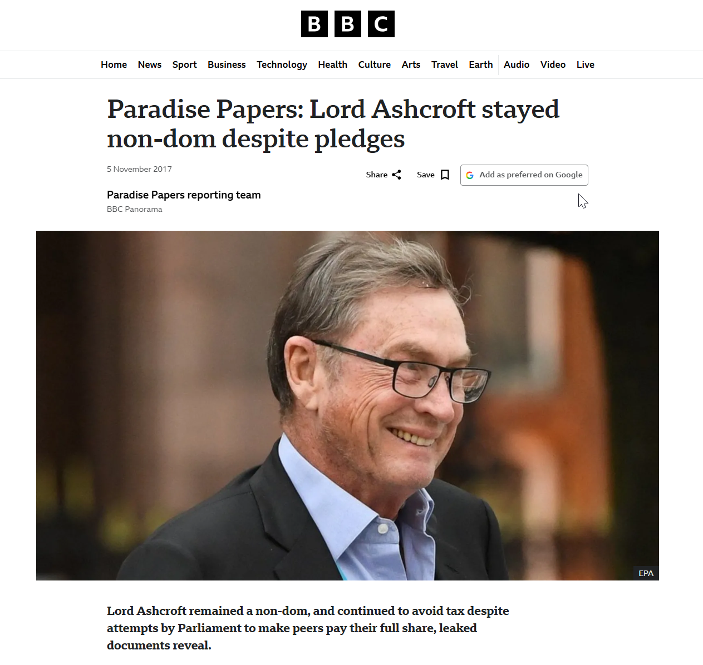

Ashcroft_bbc

Компаній, пов’язані з цим політиком також фігурують у глобальних витоках даних про офшори. Згідно з [даними Panama Papers](https://offshoreleaks.icij.org/nodes/11011876), Carlisle Holdings Limited, яка скоріше за все [належить](https://www.sec.gov/Archives/edgar/data/882505/000119312505139547/d20f.htm) Ешкрофту, має статус посередника в офшорних операціях. У базі [Offshore Leaks](https://offshoreleaks.icij.org/nodes/10212484) вказано, що агентом зареєстрованої на Багамах компанії виступала Mossack Fonseca, а посередником — Carlisle Holdings Limited. За даними [Pandora Papers](https://offshoreleaks.icij.org/nodes/240080366), посередником для іншої офшорної структури виступав Belize Bank Limited.

Згадки Майкла Ешкрофта можна зустріти також і в матеріалах, пов'язаних із Джеффрі Епштейном. Проте він згадується не як приятель чи партнер цього злочинця. Навпаки, [Епштейн радить](https://www.justice.gov/epstein/files/DataSet%2011/EFTA02528796.pdf) представнику лейбористів [Пітеру Мандельсону](https://www.irishtimes.com/world/us/2026/01/30/jeffrey-epstein-sent-thousands-of-pounds-to-peter-mandelsons-husband-emails-show/), як завдати консерваторам репутаційного удару через походження грошей Ешкрофта. Решта згадок — нейтральне [обговорення новин](https://www.justice.gov/epstein/files/DataSet%209/EFTA00762260.pdf), пов'язаних з фінансами чи [британською політикою](https://www.justice.gov/epstein).

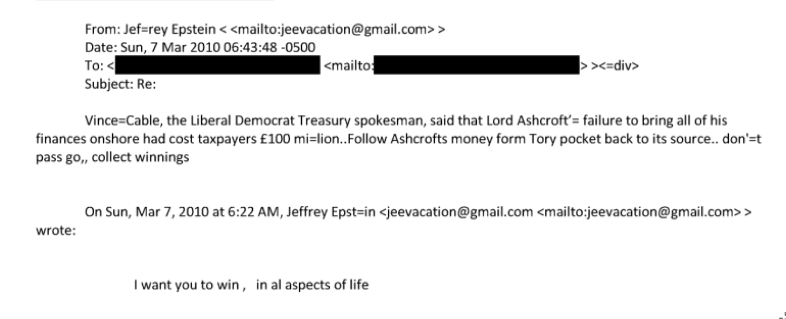

Acrobat_WeDt4SMukg

Втім, юридично Ешкрофт жодного разу не був визнаним винним у корупції, відмиванні коштів чи ухилянні від сплати податків. Більше того, медіа, які [публікували звинувачення](https://en.wikipedia.org/wiki/Michael_Ashcroft) проти нього, згодом були [змушені вибачатися](https://pressgazette.co.uk/independent-apologises-lord-ashcroft-over-scandalous-corruption-reports).

## Кримінальні справи

Деяких людей з оточення Гончаренка пов'язують із ним не лише бізнес-інтереси: вони самі або їхні родичі фігурують у кримінальних провадженнях.

Найцікавіший кейс — родина Паращенків — впливові аграрії з Одещини. Сергій Володимирович Паращенко (батько) у 2019 році був першим заступником голови Одеської обласної державної адміністрації, а з [10 квітня 2019 року](https://zakon.rada.gov.ua/laws/show/120/2019) [указом Президента](https://podrobnosti.ua/2292752-prezident-priznachiv-vikonujuchogo-obovjazkv-odesko-oda.html) тимчасово виконував обов'язки її голови; [у 2015 році](https://dumskaya.net/wiki/Sergej-Paraschenko/) він очолював [фракцію «Блок Петра Порошенка „Солідарність“»](https://activeorgua-bit.github.io/cc-callcenters/) в Одеській облраді. Його син, Сергій Сергійович Паращенко (народився [9 вересня 1995 року](https://obrantsi.ua/authorities/odeska-oblasna-rada/sergii-parashhenko-sergiiovic)), є депутатом Одеської обласної ради VIII скликання та членом комісії з питань управління майном.

Зв'язок із Гончаренком можна прослідкувати через бізнес та громадські організації. Паращенко-молодший володіє 49% і є кінцевим бенефіціаром Сільськогосподарського виробничого кооперативу «Дружба народів» (ЄДРПОУ 03766990), який значиться серед спонсорів на сайті [мережі «Гончаренко центр»](https://reestr.initask.com/company/03766990).

Проте цією родиною та її бізнесами цікавляться не лише журналісти-розслідувачі, а й правоохоронні органи. 10 липня 2023 року Служба безпеки України внесла до ЄРДР кримінальне [провадження № 22023240000000123](https://reyestr.court.gov.ua/Review/127517699). За версією слідства, справа стосується [пособництва державі-агресору](https://clarity-project.info/court/decision/126925855) шляхом передачі матеріальних ресурсів її збройним формуванням. 26 лютого 2025 року СБУ провела [обшуки](https://reyestr.court.gov.ua/Review/125894660) на двох об'єктах, які перебувають у володінні СВК «Дружба народів». 14 травня 2025 року, з дозволу слідчого судді від 12 травня, відбулися обшуки у Фермерському господарстві «Агрофірма Бургуджі» та за місцем реєстрації Приватного підприємства «[Агрофірма Ташлик](https://reyestr.court.gov.ua/Review/127517703)», а 19 травня суд наклав арешт на вилучене майно. Власником та керівником «Агрофірми Бургуджі» є [Паращенко-молодший](https://cpi.org.ua/news/odeskij-deputat-otrimav-3-miljoni-vid-kompaniyi-ya/), а бенефіціаром «Агрофірми Ташлик» — [Паращенко-старший](https://intent.press/ru/news/anticorruption/2025/odesskii-deputat-zadeklariroval-3-milliona-dividendov-ot-firmy-kotoroi-vladeet-s-kollegami/).

Важливий момент: Сергію Паращенку та його сину про підозру у цій справі не повідомлено. Та одного з фігурантів цієї справи вже [засуджено](https://clarity-project.info/court/decision/128680607): 26 червня 2025 року Пересипський суд затвердив угоду про визнання винуватості та виніс вирок Олександру Паращенку. Родинний зв'язок випливає з [ухвали](https://reyestr.court.gov.ua/Review/127517699) слідчого судді: засновника «Агрофірми Ташлик» (її бенефіціар — Паращенко-старший) там названо «*рідним братом підозрюваного*» і сказано, що він *«можливо причетний»* до цієї діяльності; засновник «Агрофірми Бургуджі», тобто Паращенко-молодший, за ухвалою, «*допомагає останньому в керівництві*» родинними підприємствами.

Суд визнав Олександра Паращенка винним у колабораційній діяльності (ч. 2 ст. 28, [ч. 4 ст. 111-1 КК](https://reyestr.court.gov.ua/Review/128680596)). Ідеться про такий епізод: він був єдиним засновником російського ТОВ «СП им. Димитрова» з Калузької області та діяв за попередньою змовою з директором фірми — 23 січня 2023 року за його наказом з рахунку компанії переказали 100 тис. рублів «*представнику оперативного штабу допомоги військовослужбовцям рф*» на Донеччині й Луганщині. За угодою з прокуратурою від 19 червня 2025 року обвинувачений отримав штраф у 170 тис. грн і заборону обіймати посади в органах державної влади на 10 років, без конфіскації майна — тобто практично найлегший із можливих варіантів покарання за цією статтею. Підставою для цього суд назвав ст. 69 ККУ — щире каяття, визнання вини, сприяння розкриттю злочину та добровільне перерахування матеріальної допомоги на потреби ЗСУ.

Справа СБУ, у якій фігурують Паращенки, не була широко висвітлена публічно, проте в інших справах Олексій Гончаренко не соромиться відкрито захищати своїх близьких. Одним із найгучніших епізодів стала справа Лесі Дерев'янко. [1 травня 2023 року](https://www.slovoidilo.ua/persony/honcharenko-oleksii-oleksiiovych) ЗМІ повідомили, що Служба безпеки України викрила родичів нардепа — депутата Одеської облради та його дружину, які, за формулюванням медіа, «організували рейдерське захоплення землі біля моря». Того ж дня Гончаренко публічно заявив, що йдеться про його «троюрідну сестру», і написав, що її посадили в СІЗО *«за те, що я намагаюсь боротись за військові виплати, за те, що піднімаю питання строковиків, відпусток і взагалі [критикую Єрмака](https://www.ukrinform.ua/rubric-society/3703339-goncarenko-zaaviv-so-za-pidozrou-u-mahinaciah-iz-zemleu-zatrimali-jogo-rodicku.html)»*.

Леся Дерев'янко — дружина Миколи Дерев'янка, депутата Одеської обласної ради від фракції «Європейська Солідарність». За даними реєстрів, попереднє прізвище жінки — Гончаренко-Бейдіна. Офіційно вона працює юристкою у ТОВ «Укрмежбуд». Історія цієї компанії дуже показова: в історії змін ЄДР засновником фірми раніше був сам Микола Дерев'янко, а згодом засновником у ЄДР став Володимир Герасимчук. За даними аналітичної системи Clarity Project, «Укрмежбуд» є активним учасником державних закупівель: компанія перемогла у тендерах на 227,98 млн грн. Найбільшим замовником стало Управління освіти Красносільської сільради (76,1 млн грн), а також Цебриківська селищна рада, з якою уклали 25 договорів на 24,7 млн грн.

Примітно, що головний епізод справи стосується земель саме Цебриківської громади та бази відпочинку «Зв'язківець» АТ «Укрпошта» в Затоці. За версією обвинувачення, у 2019–2023 роках організована група за підробленими документами оформила права на 78 земельних ділянок сільгосппризначення площею 271 га та майно бази відпочинку, після чого передала їх підконтрольним фірмам.

Слідство вважає керівником групи Миколу Дерев'янка, а Лесі відведено роль співорганізаторки. Наразі справа (№ 522/5707/24) перебуває на стадії судового розгляду в Приморському районному суді м. Одеси. Леся Дерев'янко має статус обвинуваченої, вироку щодо неї немає.

Це не єдина кримінальна історія навколо родини. Існує ще одна справа, яку розслідували НАБУ та САП, щодо облаштування вуличного освітлення в смт Цебрикове. За фабулою справи, договори з тим самим ТОВ «Укрмежбуд» штучно ділили на частини, ціни на світильники завищили більш ніж у 6 разів, а збитки громаді склали 16,4 млн грн. У цій справі Микола Дерев'янко та директор «Укрмежбуду» Герасимчук вже отримали вирок першої інстанції у ВАКС (який ще не набрав законної сили).

Варто наголосити: згідно із законом, особа вважається невинуватою до винесення вироку суду. Ані сам Олексій Гончаренко, ані його компанії у цих кримінальних провадженнях не названі.

## «Нова партія»?

[У 2024 році](https://glavcom.ua/publications/blok-saakashvili-zminiv-vivisku-usi-nitki-vedut-do-nardepa-h-1134038.html) група народних депутатів започаткувала Чорноморський безпековий форум. Як звернув увагу «Главком», на сайті платформи прямо вказано, що вона діє «*під проводом народного депутата України Олексія Гончаренка*». В березні 2026 року[^147] в Одесі була зареєстрована ГО «*Чорноморський безпековий форум*» ([ЄДРПОУ 46221313](https://clarity-project.info/edr/46221313)), юридична адреса: проспект Лесі Українки, 16/3, квартира 13. За цією самою адресою зареєстровано політичну силу «Нова партія» ([ЄДРПОУ 40272226](https://opendatabot.ua/c/40272226)). А в тому самому будинку, за даними [депутатського порталу Одеської міськради](https://deputat.odessa.ua/deputies/obuhov-petro-gennadiyovich/offices/), діє приймальня міського депутата Петра Обухова — [помічника-консультанта Гончаренка](https://itd.rada.gov.ua/mps/info/page/17984) на громадських засадах.

Керівником «Нової партії» є [Максим Колєсніков](https://opendatabot.ua/c/40272226) — колишній [помічник](https://glavcom.ua/publications/blok-saakashvili-zminiv-vivisku-usi-nitki-vedut-do-nardepa-h-1134038.html) Олексія Гончаренка. Окрім цього, він обіймав посаду директора з технічних питань та логістики мережі «Гончаренко центрів»[^150]. А на позачергових виборах до Верховної Ради в окрузі на Одещині у 2021 році — членом окружної виборчої комісії за квотою фракції «Європейська солідарність».

Цікаво, наскільки насправді новою є ця політсила. Спойлер: не дуже.

Партія зареєстрована у 2016 році і називалась вона «Грузинська партія України» — саме так її назву записано в ЄДР. У квітні 2017 року назву було змінено на «Блок Міхеіла Саакашвілі». Утім, за словами соратників Саакашвілі, цей проєкт не мав стосунку до справжнього експрезидента Грузії. Співзасновник партії «Рух нових сил» Давід Сакварелідзе вважає, що це був технічний проєкт: «Аби заплутати виборця, вони вдалися до комбінації». За його словами, політичні опоненти знайшли громадянина України Олега Сушка, який за $5 тис. погодився змінити ім'я та прізвище на Міхеіла Саакашвілі.

Ця партійна оболонка роками лишалася [замороженою](https://opendatabot.ua/c/40272226) до змін назви та керівника наприкінці травня 2026 року.

Сам Олексій Гончаренко у коментарі журналістам заперечив зв'язок із «Новою партією» та заявив, що не створює власного політичного проєкту.  Цікаво подивитися, що він робитиме після виключення із фракції.

Постає лише одне питання, чому Порошенко позбувся скандального колеги лише зараз? Імовірна причина — популярність та ресурси Гончаренка на Одещині. У 2019 році Гончаренко виграв [округ №137](https://www.cvk.gov.ua/pls/vnd2019/wp033pt001f01=919pf7331=137.html) як безпартійний самовисуванець із результатом майже 30%. «ЄС» у тому самому окруіз набрали лише [4,4%](https://www.cvk.gov.ua/pls/vnd2019/wp304pt001f01=919pf7331=137.html). За «Слугу народу» там [проголосували 49%](https://www.cvk.gov.ua/pls/vnd2019/wp306_npt001f01=919.html).

Варто зауважити, що склад одеського осередку Євросолідарності загалом є досить специфічним. Приміром, серед [10 чинних депутатів](https://oblrada.od.gov.ua/blog/deputy-fraction/deputatska-fraktsiya-politychnoyi-partiyi-yevropejska-solidarnist/) Одеської облради [четверо в минулому](https://www.cvk.gov.ua/pls/vm2015/pvm056pid102=9473pf7691=9473pt001f01=100rej=0pt00_t001f01=100.html) [були пов’язані з проросійськими силами](https://www.cvk.gov.ua/pls/vm2010/wm02815pid112=12pid102=9473pf7691=9473rej=0pt00_t001f01=800pxto=0.html)[^156].

## Що в залишку?

Журналісти та блогери називають Гончаренка «[російською консервою](https://www.unian.ua/politics/goncharenka-mogli-integruvati-do-partiji-poroshenka-yak-fsbshnu-konservu-viyskoviy-13189161.html)». Проте постає питання, а чи були його погляди колись законсервованими? Послідовне тиражування російських наративів, [навчання у Москві](https://www.slovoidilo.ua/persony/honcharenko-oleksii-oleksiiovych), членство в Партії регіонів [у 2005–2014 роках](https://bihus.info/nardep-goncharenko-v-separatistskikh-nastroyakh-na-skhodi-e-i-moya-vina/), захист російської мови, тесть, який, за словами самого Гончаренка, [працював у «Газпромі»](https://www.youtube.com/watch?v=nUhnlRXnD6A), втікачі та фігуранти справ про колабораціонізм серед спонсорів... Усе це не є доказом агентурної діяльності, і таких звинувачень ми не висуваємо. Але, на нашу думку, цього достатньо, щоб назавжди викреслити для себе цього політика зі списку кандидатів на будь-які державні посади.

Сподіваємося, теза, що в українців «коротка пам'ять», більше не є справедливою щодо суспільства, яке платить надвисоку ціну за свою незалежність. І це останній політичний сезон, коли ми спостерігаємо в парламенті цього персонажа та йому подібних.

[^23]: Досьє Гончаренка
[^38]: Clarity Project: ГОНЧАРЕНКО ОЛЕКСІЙ ОЛЕКСІЙОВИЧ — вкладка «Інші реєстри (3)»
[^68]: 0913012121_1791053097457
[^89]: [першоджерело не встановлено; переказ у: Вікіпедія: Radio ROKS] Власником «Радіо РОКС Україна» з осені 2008 року є холдинг «ТАВР Медіа».
[^100]: cd898cd9-d244-4ae2-bb20-72186c4ba4b8
[^103]: Хто фінансує Гончаренко центри – гроші йдуть від компанії Бахматюка - ZN.ua
[^118]: Lord Ashcroft 'avoided £3.4m in tax' ahead of rule change _ Michael Ashcroft _ The Guardian
[^147]: ГО _ЧОРНОМОРСЬКИЙ БЕЗПЕКОВИЙ ФОРУМ_ (ЄДРПОУ 46221313) - перевірка компанії _ Clarity Project
[^150]: Помощник Алексея Гончаренко возглавил «Новую партию»_ что известно о политическом проекте • Портал АНТИКОР
[^156]: Дослідження «Шахрайські колцентри: дії правоохоронців» — дашборд <https://activeorgua-bit.github.io/cc-callcenters/> (дані і код: <https://github.com/activeorgua-bit/cc-callcenters>). З 10 чинних депутатів Одеської обласної ради VIII скликання від «Європейської Солідарності» 4 (40%) раніше висувалися від проросійських сил — Партії регіонів, «Довіряй ділам» чи «Відродження»; членом Партії регіонів серед чинних був 1
